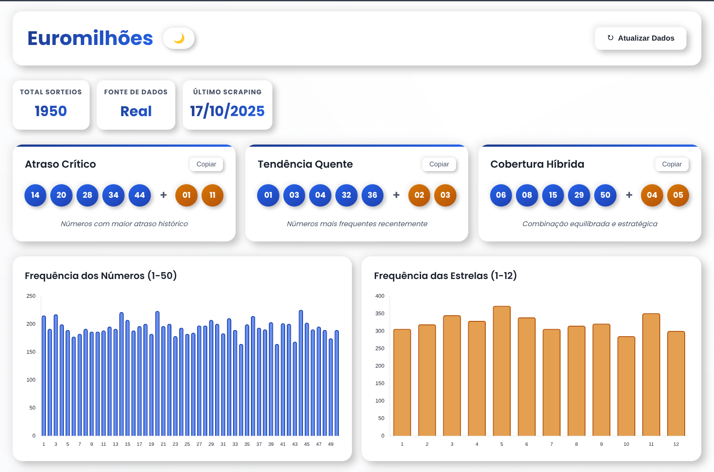

# Euromilhões Analyzer

[](https://opensource.org/licenses/MIT) [](https://www.python.org/) [](https://www.selenium.dev/) [](https://flask.palletsprojects.com/) [](https://www.crummy.com/software/BeautifulSoup/)



This project is a tool for performing statistical analysis on historical Euromillions results. It scrapes draw data from 2004 onwards, analyzes it, and generates strategic number combinations.

The analysis is presented in a web dashboard that provides a visual and interactive experience, including frequency charts and data history.

## Tech Stack

- **Python** as the core language.
- **Selenium** for web scraping the draw data.
- **Flask** to serve the web dashboard.
- **BeautifulSoup4** for HTML parsing.
- **requests**, **lxml**, and **webdriver-manager** as supporting libraries.

## Setup and Usage

### Get the Code

Clone the repository to your local machine.

```bash
git clone https://github.com/dapovoa/euromilhoes.git
cd euromilhoes
```

### Create and Activate Virtual Environment

It is recommended to create a virtual environment to isolate project dependencies.

```bash
# Create the environment
python3 -m venv venv

# Activate on Linux/macOS
source venv/bin/activate
```

### Install Dependencies

With the virtual environment activated, install the required libraries.

```bash
pip install -r requirements.txt
```

### Run the Application

To run the web dashboard:

```bash
python main.py
```
The server will be available at `http://127.0.0.1:5001`.

## Project Structure

-   `chrome/`: Holds the auto-downloaded headless Chrome binary.
-   `data/`: Caches results for the web dashboard (`cache.json`).
-   `web/`: Contains static assets for the dashboard (HTML, CSS, JS).
-   `logic.py`: Contains the core analysis and web scraping logic.
-   `main.py`: The Flask server script for the web dashboard.
-   `utils.py`: Shared utility functions.
-   `requirements.txt`: The list of project dependencies.
-   `LICENSE`: The project's license file.
-   `README.md`: This file.

## License

This project is under the MIT License. See the [LICENSE](LICENSE) file for details.